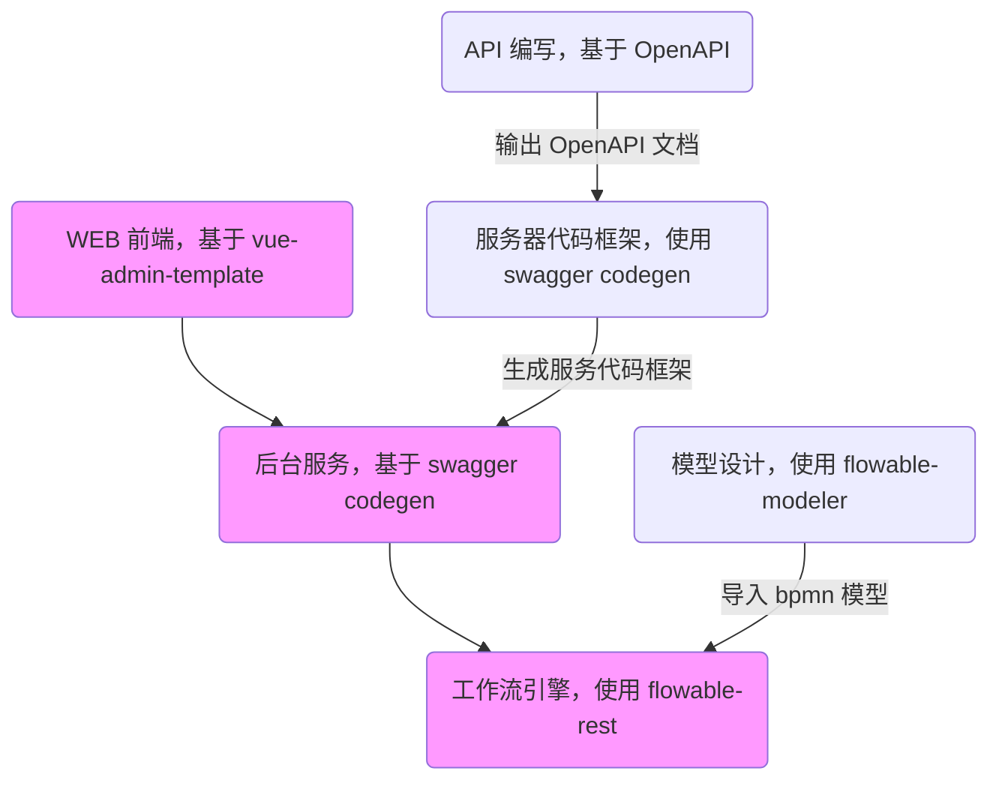
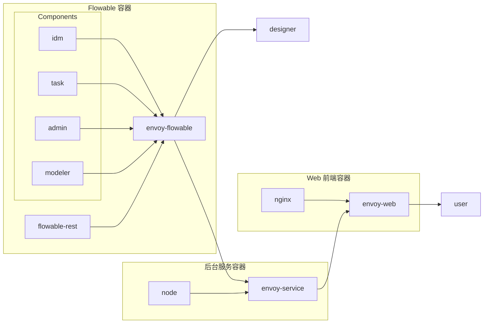

# 总体设计

## 构架



## 部署

采用 Docker 部署的方式。

### 总体部署




### 开发环境中 Flowable 的部署

基于官方 **all-in-one-postgres.sh** 部署脚本，该脚本一次性部署了 **flowable-idm**、**flowable-task**、**flowable-admin**、**flowable-modeler** 四个组件，包含了 **flowable-rest** 服务，并启动了 **PostgreSQL** 数据库来做数据持久化。

> **Flowable 组件的功能**：
>
> - **flowable-idm**：用户管理，并为其它组件提供单点登录功能。**flowable-task**、**flowable-admin**、**flowable-modeler** 必须依赖于 **flowable-idm**。
> - **flowable-task**：任务管理，提供正在执行的工作流视图，并可结束某个工作流。
> - **flowable-admin**：端节点管理，配置、管理提供服务的端节点，一般情况下不需要配置。
> - **flowable-modeler**：建模工具，有可以离线工作的 Eclipse plug-in 版本。
> - **flowable-rest**：工作流服务，并对外提供 RESTful API 调用。与其它四个组件无关，不依赖于用户管理，在最终部署的时候，只需要这个组件。

#### 配置

##### 端口调整

官方脚本使用了 **8080** 端口，提供上述组件服务。由于 8080 端口太过热门，开发过程中为了避免冲突，将组件服务端口调整为 **18080**。

修改 `config/all-in-one-postgres.yaml`：

```yaml
version: '3.6'
services:
  flowable-all-in-one-app:
    environment:
      # 添加以下环境变量
      - FLOWABLE_COMMON_APP_IDM-REDIRECT-URL=http://localhost:18080/flowable-idm
    ports:
      # 修改映射端口
      - 18080:8080
```


##### Sidecar（envoy-flowable）

向**“流程设计师”**提供 Flowable 组件服务，向后台服务提供 Flowable REST API 服务。

- 配置文件为：`config/envoy-flowable.yaml`
- 组件服务地址：
  - flowable-idm：http://localhost:18080/flowable-idm
  - flowable-task：http://localhost:18080/flowable-task
  - flowable-admin：http://localhost:18080/flowable-admin
  - flowable-modeler：http://localhost:18080/flowable-modeler
- REST API 端点地址：
  - Process API：http://localhost:18080/flowable-task/process-api


