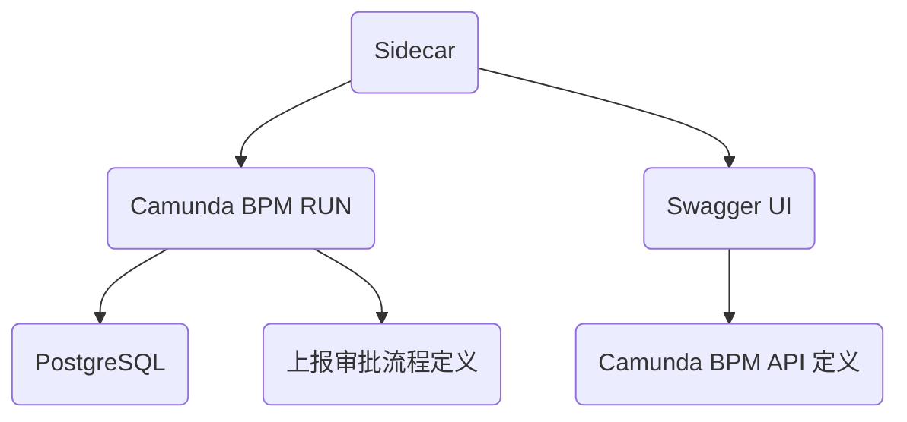

# Camunda BPM Docker 部署

## 部署架构

> - Camunda BPM RUN 自动加载“[上报审批流程定义](../../process-definition)”
> - Swagger UI 自动加载“[Camunda BPM API 定义](./camunda-openapi)"

## 服务端点

WebApp：http://localhost:9001

REST API：http://localhost:9001/engine-rest

Docs：http://localhost:9001/docs

> 支持跨域访问