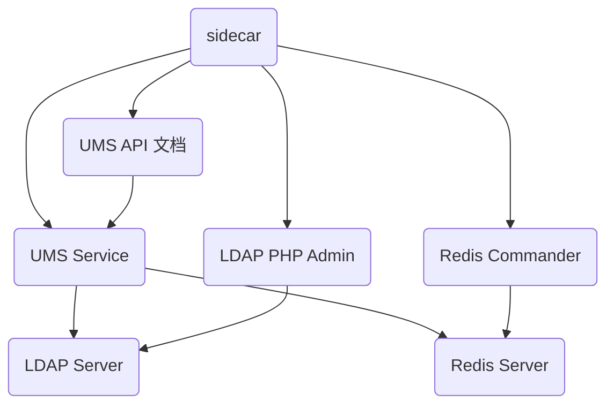

# UMS 部署

## 部署架构

> USM Service 自带 UMS API 文档。

## 服务端点

UMS Service：http://localhost:9002/ums

UMS API 文档：http://localhost:9002/docs

LDAP PHP Admin：http://localhost:9002/phpldapadmin

Redis Commander：http://localhost:9002/redis-commander

> 支持跨域访问

