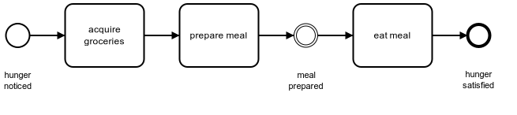

# BPMN Tutorial

本教程由 [Camunda](https://camunda.com/bpmn/) 提供。

## 为什么要使用 BPMN

**BPMN**（Business Process Model and Notation，业务流程建模和标注）是流程建模的全球标准，是企业成功进行业务 IT 标准化（Business-IT-Alignment）的最重要组成部分。

越来越多的企业开始使用 BPMN，越来越多的大学将 BPMN 作为一门课程来教授。原因如下：

- **标准：**BPMN 是由 [OMG](https://www.omg.org) 制订的国际标准（OMG —— Object Management Group 制订了众多的国际标准，UML 也是由他们制订的）。支持该标准的软件产品很多，可以很简单的从一款产品切换到另一款产品，减少了对特定供应商的依赖。
- **简单：**BPMN 背后的原理很简单。透过本教程，可以快速掌握 BPMN 的基本原理，比开始流程建模。
- **强大的表达能力：**可以使用 BPMN 初略地表达流程，也可以非常精确地描述一个流程。
- **易于实施：**BPMN 的主要目的是支持“流程自动化”的实施。公司对 IT 的依赖度越高，BPMN 就越有用。

## 使用 BPMN 描述一个简单流程

我们从一个非常简单的流程开始 BPMN 教学：

这个流程在某个人饿了的时候被触发，他先去杂货铺买了些食材，然后准备餐食，最后饱餐一顿。这个简单的流程，包含了以下 BPMN 元素：

- Start Event：开始事件表示哪些事件将触发流程。例如，这里是：感觉到饿。
- Task：任务是流程的核心。它会执行一些操作，获得期望的结果。
- Intermediate Event：中间事件表示流程达到了某个中间状态。中间事件并不常用，但是在某些情况下很有用，例如：希望记下流程达到某个里程碑的时间，就需要用到中间事件。
- End Event：结束事件表示流程已经结束了。

> 最佳实践：命名约定
>
> 在命名任务的时候，应该遵循**“[动词] + [对象]"**的设计原则。例如：”购买食材“

