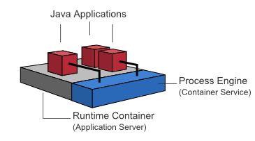

# 写给 Node.js 开发者的 Camunda BPM 简明指南


## 概述

Camunda BPM 是一款用 Java 编写的轻量级工作流引擎，支持 BPMN 2.0、CMMN 1.1、DMN 1.3 标准。


最终用户应用即可以将 Camunda BPM 作为库，将工作流引擎内嵌到独立运行的 Java 应用程序中：


或者在一个 Web 容器中运行 Camunda BPM，同一容器内的多个 Java 应用可以共享这个工作流引擎服务：



也可以将 Camunda BPM 作为独立运行的工作流引擎服务器，应用程序通过 REST API 来调用工作流引擎服务：


由于 Camunda BPM 采用了***无状态工作***的设计，因此它天然支持共享数据库的集群方式：


> Camunda BPM 工作模式详见：[Camunda BPM Introduction - Architecture Overview](https://docs.camunda.org/manual/7.13/introduction/architecture/)

对于 Node.js 开发者来说，最常用 **“Standalone Process Engine Server”** 模式，使用 REST API 调用工作流引擎服务。官方文档主要围绕 **“Embbed Process Engine”** 模式，针对 Java 开发进行论述，对 Node.js 开发者来说并不友好。本文档以官方文档为基础，结合实践，阐述 Node.js 开发者如何使用 Camunnda BPM 来进行应用程序开发。


## 安装

从概述的系统结构图中我们知道，Camunda BPM Platform 分为以下几个部分：

- Modeler：建模器应用
- Cockpit、Admin、Tasklist：基于 Web 的管理应用
- Engine：工作流引擎


### Camunda Modeler

Modeler 是一个独立的应用程序，有 Windows、macOS、Linux 版本。从[官方页面](https://camunda.com/download/modeler/?__hstc=12929896.cea68860d9fb41d2663c7bcdc5d03ba0.1589530777836.1592797038589.1592802265273.13&__hssc=12929896.5.1592802265273&__hsfp=536848064)下载最新版 Modeler，并安装。


### Camunda BPM 发行版

Camunda BPM 发行版是 Camunda 官方的预编译版本，它包括了：Camunda Web 应用（Cockpit、Admin、Tasklist）和 REST API。 发行版又分为：

- 独立的 Web 应用程序发行版：Camunda BPM Run，基于 Spring 框架的可独立运行的 Web 应用程序。
- 完整发行版：Camunda BPM Full Distribution，基于 Java Web 容器的发行版。
  - Tomcat 容器发行版
  - JBoss/Wildfly 容器发行版

对于 Node.js 开发者来说，只能采用 Standalone Process Engine Server 的开发模式，使用 REST API 访问工作流引擎服务，因此**以上的发行版均可以满足要求，并无区别**。

> Camunda BPM 又分为：社区版（Community Edition）和企业版（Enterprise Edition）。顾名思义，企业版是需要付费的，而社区版是开源免费的。社区版已能满足绝大部分的需求，以下的讨论仅限于社区版。


### Docker 部署

采用 Docker 部署是最简单、最易于维护的方式，开发者无需熟练掌握 Java 的相关基础知识。

官方给出了三个发行版的 Docker 镜像：

- camunda/camunda-bpm-platform:latest：Tomcat 容器发行版
- camunda/camunda-bpm-platform:wildfly-latest：Wildfly 容器发行版
- camunda/camunda-bpm-platform:run-latest：Camunda BPM Run 发行版

采用任何一个发行版均可满足 Node.js 开发者的需要。

使用 Tomcat 发行版：

```bash
$ docker pull camunda/camunda-bpm-platform:latest
$ docker run -d --name camunda -p 8080:8080 camunda-bpm-platform:latest
```


### 访问入口

Welcome 访问入口：http://localhost:8080/camunda-welcome

也可以直接访问 Web 应用程序：http://localhost:8080/camunda/app

用户名/密码：demo/demo

REST API 根节点：http://localhost:8080/engine-rest

默认 REST API 访问是不需要进行身份认证的。


### 连接数据库

Camunda BPM 默认的数据库是 H2 —— 一个内存数据库，重启服务时，数据会丢失，因此需要连接到一个外部数据库来进行数据持久化。

Camunda BPM 支持的数据库包括：

- MySQL 5.6 / 5.7
- MariaDB 10.0 / 10.2 / 10.3
- Oracle 11g / 12c / 18c / 19c
- IBM DB2 10.5 / 11.1 (excluding IBM z/OS for all versions)
- PostgreSQL 9.4 / 9.6 / 10.4 / 10.7 / 11.1 / 11.2 / 12.2
- Amazon Aurora PostgreSQL compatible with PostgreSQL 9.6 / 10.4 / 10.7
- Microsoft SQL Server 2012/2014/2016/2017
- H2 1.4

PostgreSQL 性能上优于 MySQL 5，且开源、免费，因此采用 PostgreSQL 作为外部数据库，采用 docker-compose 的方式进行部署。

`docker-compose.yaml`：

```yaml
version: "3.7"
services:
  camunda-bpm-platform:
    image: camunda/camunda-bpm-platform:latest
    container_name: camunda-bpm
    depends_on:
      - camunda-db
    environment:
      - DB_DRIVER=org.postgresql.Driver
      - DB_URL=jdbc:postgresql://camunda-db:5432/camunda
      - DB_USERNAME=camunda
      - DB_PASSWORD=camunda
      - WAIT_FOR=camunda-db:5432
    expose:
      - 8080
    ports:
      - 8080:8080

  camunda-db:
    image: postgres:9.6-alpine
    container_name: camunda-db
    environment:
      - POSTGRES_PASSWORD=camunda
      - POSTGRES_USER=camunda
      - POSTGRES_DB=camunda
    expose:
      - 5432
    volumes:
      - camunda_pgdata:/var/lib/postgresql/data
    command: postgres

volumes:
  camunda_pgdata:
```


### 配置身份认证

Camunda BPM REST API 支持 HTTP Basci Authentication（HTTP 基本身份认证）。为了方便开发，Camunda BPM REST API 默认关闭身份认证。但是，在生产环境中，关闭身份认证有安全风险的，需要开启身份认证。

修改 `/conf/web.xml`，添加以下的 Servlet Filter：

```xml
<filter>
  <filter-name>camunda-auth</filter-name>
  <filter-class>
    org.camunda.bpm.engine.rest.security.auth.ProcessEngineAuthenticationFilter
  </filter-class>
  <async-supported>true</async-supported>
  <init-param>
    <param-name>authentication-provider</param-name>
    <param-value>org.camunda.bpm.engine.rest.security.auth.impl.HttpBasicAuthenticationProvider</param-value>
  </init-param>
</filter>
<filter-mapping>
  <filter-name>camunda-auth</filter-name>
  <url-pattern>/*</url-pattern>
</filter-mapping>
```


## REST API 中的变量

