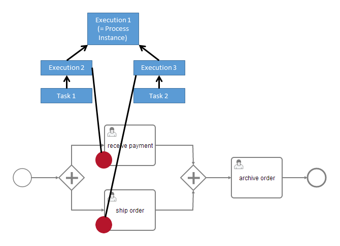

# 写给 Node.js 开发者的 Camunda BPM 简明指南


## 概述

Camunda BPM 是一款用 Java 编写的轻量级工作流引擎，支持 BPMN 2.0、CMMN 1.1、DMN 1.3 标准。


最终用户应用即可以将 Camunda BPM 作为库，将工作流引擎内嵌到独立运行的 Java 应用程序中：


或者在一个 Web 容器中运行 Camunda BPM，同一容器内的多个 Java 应用可以共享这个工作流引擎服务：


也可以将 Camunda BPM 作为独立运行的工作流引擎服务器，应用程序通过 REST API 来调用工作流引擎服务：


由于 Camunda BPM 采用了***无状态工作***的设计，因此它天然支持共享数据库的集群方式：


> Camunda BPM 工作模式详见：[Camunda BPM Introduction - Architecture Overview](https://docs.camunda.org/manual/7.13/introduction/architecture/)

对于 Node.js 开发者来说，最常用 **“Standalone Process Engine Server”** 模式，使用 REST API 调用工作流引擎服务。官方文档主要围绕 **“Embbed Process Engine”** 模式，针对 Java 开发进行论述，对 Node.js 开发者来说并不友好。本文档以官方文档为基础，结合实践，阐述 Node.js 开发者如何使用 Camunnda BPM 来进行应用程序开发。


## 安装

从概述的系统结构图中我们知道，Camunda BPM Platform 分为以下几个部分：

- Modeler：建模器应用
- Cockpit、Admin、Tasklist：基于 Web 的管理应用
- Engine：工作流引擎


### Camunda Modeler

Modeler 是一个独立的应用程序，用于 BPMN、DMN、CMMN 建模，有 Windows、macOS、Linux 版本。从[官方页面](https://camunda.com/download/modeler/?__hstc=12929896.cea68860d9fb41d2663c7bcdc5d03ba0.1589530777836.1592797038589.1592802265273.13&__hssc=12929896.5.1592802265273&__hsfp=536848064)下载最新版 Modeler，并安装。


### Camunda BPM 发行版

Camunda BPM 发行版是 Camunda 官方的预编译版本，它包括了：Camunda Web 应用（Cockpit、Admin、Tasklist）和 REST API。 发行版又分为：

- 独立的 Web 应用程序发行版：Camunda BPM Run，基于 Spring 框架的、可独立运行的 Web 应用程序。
- 完整发行版：Camunda BPM Full Distribution，基于 Java Web 容器的发行版，分为：
  - Tomcat 容器发行版
  - JBoss/Wildfly 容器发行版

对于 Node.js 开发者来说，只能采用 Standalone Process Engine Server 的开发模式，使用 REST API 访问工作流引擎服务，因此**以上的发行版均可以满足要求，并无区别**。

> Camunda BPM 又分为：社区版（Community Edition）和企业版（Enterprise Edition）。顾名思义，企业版是需要付费的，而社区版是开源免费的。社区版已能满足绝大部分的需求，以下的讨论仅限于社区版。


### Docker 部署

采用 Docker 部署是最简单、最易于维护的方式，开发者无需熟练掌握 Java 的相关基础知识。

官方给出了三个发行版的 Docker 镜像：

- camunda/camunda-bpm-platform:latest：Tomcat 容器发行版
- camunda/camunda-bpm-platform:wildfly-latest：Wildfly 容器发行版
- camunda/camunda-bpm-platform:run-latest：Camunda BPM Run 发行版

采用任何一个发行版均可满足 Node.js 开发者的需要。

使用 Tomcat 发行版：

```bash
$ docker pull camunda/camunda-bpm-platform:latest
$ docker run -d --name camunda -p 8080:8080 camunda-bpm-platform:latest
```


### 访问入口

Welcome 访问入口：http://localhost:8080/camunda-welcome

也可以直接访问 Web 应用程序：http://localhost:8080/camunda/app

用户名/密码：demo/demo

REST API 根节点：http://localhost:8080/engine-rest

默认 REST API 访问是不需要进行身份认证的。


### 连接数据库

Camunda BPM 默认的数据库是 H2 —— 一个内存数据库，重启服务时，数据会丢失，因此需要连接到一个外部数据库来进行数据持久化。

Camunda BPM 支持的数据库包括：

- MySQL 5.6 / 5.7
- MariaDB 10.0 / 10.2 / 10.3
- Oracle 11g / 12c / 18c / 19c
- IBM DB2 10.5 / 11.1 (excluding IBM z/OS for all versions)
- PostgreSQL 9.4 / 9.6 / 10.4 / 10.7 / 11.1 / 11.2 / 12.2
- Amazon Aurora PostgreSQL compatible with PostgreSQL 9.6 / 10.4 / 10.7
- Microsoft SQL Server 2012/2014/2016/2017
- H2 1.4

PostgreSQL 性能上优于 MySQL 5，且开源、免费，因此采用 PostgreSQL 作为外部数据库，采用 docker-compose 的方式进行部署。

`docker-compose.yaml`：

```yaml
version: "3.7"
services:
  camunda-bpm-platform:
    image: camunda/camunda-bpm-platform:latest
    container_name: camunda-bpm
    depends_on:
      - camunda-db
    environment:
      - DB_DRIVER=org.postgresql.Driver
      - DB_URL=jdbc:postgresql://camunda-db:5432/camunda
      - DB_USERNAME=camunda
      - DB_PASSWORD=camunda
      - WAIT_FOR=camunda-db:5432
    expose:
      - 8080
    ports:
      - 8080:8080

  camunda-db:
    image: postgres:9.6-alpine
    container_name: camunda-db
    environment:
      - POSTGRES_PASSWORD=camunda
      - POSTGRES_USER=camunda
      - POSTGRES_DB=camunda
    expose:
      - 5432
    volumes:
      - camunda_pgdata:/var/lib/postgresql/data
    command: postgres

volumes:
  camunda_pgdata:
```


### 配置身份认证

Camunda BPM REST API 支持 HTTP Basci Authentication（HTTP 基本身份认证）。为了方便开发，Camunda BPM REST API 默认关闭身份认证。但是，在生产环境中，关闭身份认证有安全风险的，需要开启身份认证。

修改 `/conf/web.xml`，添加以下的 Servlet Filter：

```xml
<filter>
  <filter-name>camunda-auth</filter-name>
  <filter-class>
    org.camunda.bpm.engine.rest.security.auth.ProcessEngineAuthenticationFilter
  </filter-class>
  <async-supported>true</async-supported>
  <init-param>
    <param-name>authentication-provider</param-name>
    <param-value>org.camunda.bpm.engine.rest.security.auth.impl.HttpBasicAuthenticationProvider</param-value>
  </init-param>
</filter>
<filter-mapping>
  <filter-name>camunda-auth</filter-name>
  <url-pattern>/*</url-pattern>
</filter-mapping>
```


## 术语

### 流程定义（process definition）

**流程定义**描述了流程的结构。Camunda BPM 使用 BPMN 2.0 标准做为主要的流程建模语言。

定义流程时，需要指定一个 **“key”** 用来标示该流程。流程定义的相关 API，尤其是创建流程实例 API，会用到这个 key。因此，定义一个有明确意义的 key，有助于使用流程定义。

相同 key 的流程定义可以被多次部署，每次部署被视为同一个流程定义的**“新版本”**。

流程定义相关 REST API 的根路径为：`/process-definition`


### 流程实例（process instance）

**流程实例**是流程定义的具体执行。流程实例和流程定义之间的关系，类似于面向对象编程中“类”和“对象”之间的关系 —— 类是定义，对象是类的实例化。

流程实例相关 REST API 的根路径为：`/process-instance`


### 执行（Execution）

如果流程总包含多个执行路径（例如：经过一个“并行网关”之后，流程会分支出多个执行路径），开发者必须能区分当前的执行路径。Camunda BPM 通过**“执行”**来标示一个流程实例中的不同执行路径。

在下图的示例中，两个用户任务（user task）—— *receive payment* 和 *ship order* —— 可能在同一时间被激活。在工作流引擎内部，会在流程实例中创建两个并行的执行。


子流程（Sub Process）和多实例（Multi Instance）也会创建执行。

流程实例中的所有执行是层次化的，树形结构的。流程实例本身也是一个执行，位于执行树的根节点。

执行相关 REST API 的根路径为：`/execution`


### 活动实例（activity instance）

**活动实例**的概念和**执行**的概念很类似，但是又不相同。执行可以视为在流程中移动的 token，有几个 token 就有几个并行的执行；活动实例则是流程中的构件，例如：task、subprocess 等，获得 token 的活动实例，是流程实例当前处理的活动。

活动实例也会构成活动实例树，它能很好的表示一个流程实例的当前状态，例如：当前流程实例有几个待处理的活动实例、每个活动实例的创建时间、指定的处理人是谁等。

获取指定流程实例中活动实例树的 REST API：`/process-instance/{id}/activity-instances`


### 作业和作业定义（job / job definition）

Camunda BPM 中有一个称为**”作业执行器（Job Executor）“**的部件，它是一个调度后台异步工作的部件。例如，工作流引擎处理定时事件（Timer Event）时，并不会长期占用前台进程，而是将当前状态保存到数据库，并创建一个定时器作业，用定时事件来触发流程继续执行。

在部署流程定义时，工作流引擎会为每个活动创建作业定义，并在流程实例中创建作业。

作业及作业定义相关 REST API 的根路径为：`/job`、`/job-definition`


## 基于 Nodejs 的 Camunda BPM 开发流程

```flow
st=>start: Start
A=>operation: 使用 Modeler 进行建模
B=>operation: 部署流程定义
C=>operation: 启动一个流程实例
D=>operation: 用户获取任务列表
E=>operation: 用户完成当前任务
F=>condition: 流程结束？
end=>end

st->A->B->C->D->E->F
F(no)->D
F(yes)->end
```


## BPMN 建模

Camunda 官方给出了 3 篇文档来解说 BPMN 建模，建议完整阅读这 3 篇文档。

- [BPMN 新手教程](https://camunda.com/bpmn/)：该教程通过三个简单的例子来帮助初学者建立 BPMN 建模的主要概念。
- [BPMN 建模参考](https://camunda.com/bpmn/reference/)：该参考解释了 BPMN 建模中用到的所有符号含义及主要用法。
- [BPMN 建模示例、模版、及最佳实践](https://camunda.com/bpmn/examples/)：给出了很多 BPMN 建模的例子，比逐一解说这些例子的优缺点，指出规范的建模方法。其中很多示例可以直接做为模版用于建模。


## REST API 中的变量类型

在 REST API 中引用流程变量的格式如下：

```json
{
  "type": "String",
  "value": "Some value",
  "valueInfo": {}
}
```

REST API 支持以下几种格式：


> **注意：**在 REST API 中，type 的名字以大写字母开头，例如：`string` 类型，应写作 `String`。


### 原生数据类型（Primitive Types）

Camunda BPM 是基于 Java 的，因此**原生数据类型**是指不需要额外的元数据，直接存储在标准 Java 类中的数据类型。包括：boolean（布尔值）、bytes（字节数组）、short（短整型）、integer（整型）、long（长整型）、double（双精度浮点数）、string（字符串）、null（空）等 9 种类型。

原生数据类型无需设置 `valueInfo` 字段。

对 string、boolean、null 无需设置 `type` 字段，Camunda BPM 会自行推断类型。

**原生数据类型在 API 调用种，可以直接作为搜索条件对流程实例进行查询。**

> **String 类型的长度限制：**
>
> string 在数据库中对应了 `varchar` 类型，其最大长度为 4000 字节。UTF-8 编码下，每个汉字占用 3 个字节，也就是约 1300 个汉字。


### 文件类型（File Type）

（还不知道怎么用，似乎是可以 Upload / Download 一个文件）


### 对象类型（Object Type）

对象类型是自定义类型。实现对象类型的实质是把 Java 不认识的数据类型（自定义数据类型。JSON 对 Java 来说，也是自定义数据类型）映射到某个 Java 类，以实现对该自定义数据类型的操作。

对 Nodejs 开发者来说，不会在工作流引擎服务端自定义 Java 类，只能使用工作流引擎服务端内置的 Java 类，因此对象类型实际上只会用于传递通用的 JSON / Array 数据。其中：

- JSON 数据对应了 `java.util.LinkedHashMap` 类；
- Array 数据对应了 `java.util.ArrayList` 类。

在传递 JSON / Array 时，不需要设定 `type` 和 `valueInfo` 字段，Camunda BPM 会自行推断类型。

例如，可以使用以下方式定义 JSON 数据：

```json
{
  "value": {
    "country": "China",
    "city": "北京"
  }
}
```

定义 Array 数据：

```json
{
  "value": ["China", "北京"]
}
```


### JSON / XML 类型

Camunda BPM 透过 camunda-spin 来支持这两种类型，在发行版中默认加载了 camunda-spin。

本质上，JSON / XML 类型等同于映射为 `org.camunda.spin.Spin.S` 类的对象类型数据。

camunda-spin 接收符合  JSON / XML 规范格式的 string，添加了相应的 API 来将 string 转换成 Spin 对象，通过操作 Spin 对象来操作 JSON / XML。有点儿类似于 Javascript  中使用 `JSON.stringify()` 将 JSON 序列化为 String 用于传输、存储；通过 `JSON.parse()` 将 String 转换成 JSON 格式进行读写。

JSON 数据操作过程如下：

- REST API Client 将 JSON 格式化为 string，并将其传递到工作流引擎服务器端；
- 工作流引擎服务器端使用 `org.camunda.spin.Spin.JSON` 类将 string 转换为 `SpinJsonNode` 对象（object），`SpinJsonNode` 对象等同于 Javascript 中的 JSON 对象，只是提供的 API 与 Javascript JSON 对象的内置方法不同；
- 在响应 REST API Client 的请求时，工作流引擎服务器端会将 `SpinJsonNode` 对象转换成 string，并发送到客户端。

- 对 JSON 类型，工作流引擎服务端处理 JSON 的类名为：`org.camunda.spin.Spin.JSON`。

- 对 XML 类型，工作流引擎服务端处理 XML 的类名为：`org.camunda.spin.Spin.XML`。

在使用 JSON / XML 类型时，不需要设定 `valueInfo` 字段，Camunda BPM 会自行推断类型。

例如，可以使用以下方式定义 JSON 数据：

```json
{
  "type": "Json",
  "value": "{\"country\": \"China\", \"city\": \"北京\"}"
}

// 注意："value"的值是字符串，而不是 JSON 格式数据
```

> 对 Nodejs 开发者来说，Object Type 和 JSON Type 都可以处理 JSON 数据，看上去使用 Object Type 更直接，但是，**推荐使用 JSON 类型！**因为在工作流引擎服务端的 Expression 和 Script 中，可以使用 Spin API 直接引用 JSON 变量，而无法引用 Object 变量。例如，可以直接引用 JSON 作为 BPMN 中的转移条件：
>
> ```xml
> <!--
>   假设已经定义了流程变量：
> 	address: {
> 		"country": "China",
> 		"city": "北京"
> 	}
> -->
> <sequenceFlow>
>   <conditionExpression xsi:type="bpmn:tFormalExpression" language="javascript">
>     address.prop("city").value() === "北京"
>   </conditionExpression>
> </sequenceFlow>
> ```


### 在 Javascript 脚本中使用 JSON 类型

> **注意：**这里提到的 Javascript 脚本是 Camunda BPM 工作流引擎服务器中 BPMN 构件引用的 Javascript 脚本，而不是独立的 Nodejs 程序，或者 Web 页面内嵌的 Javascript 脚本。

**在服务器端的脚本中，本质上是调用 `SpinJsonNode` 的 API 来操作 JSON 数据**。

具体的 API 使用方法，参阅官方指南 —— [Reference - Spin Dataformats - JSON](https://docs.camunda.org/manual/7.13/reference/spin/json/)


### 序列化和反序列化（Serialization / Deserialization）

对象类型数据被映射为某个 Java 类，由于 Java 类无法保存到数据库，因此需要通过序列化将 Java 类转换成 string 进行保存；从数据库中读出时，则需要通过反序列化操作来恢复数据。

工作流引擎通过 `java.io.Serializable` 来完成对象序列化，序列化的结果是**“不可读的”**字符串（所谓**不可读**是指：字符串没有明显的含义，类似 Base64 编码）。

REST API 将 JSON / Array 数据传递到工作流引擎服务器时，工作流引擎会自动完成序列化；响应 REST API 请求时，Client 可以选择是否让工作流引擎服务器完成反序列化。

REST API 读出对象类型流程数据时，如果不执行反序列化，则读出内容是无法解读的。默认情况下，工作流引擎自动执行反序列化。

REST API 在操作 JSON / XML 类型数据时，Client 传出的 value 就是 string 类型，虽然在服务器端被映射成了 Spin 类，但是在回传（响应客户端请求）时，仍然应该回传 string，而不应反序列化。此时，可以通过 `deserializationValue=false` 参数，要求服务器端不执行反序列化。


## 流程变量的作用域和可见性



一个流程实例的结构如上图。流程实例本身就是一个执行（execution），根执行有两个子执行，每个子执行又各自创建了一个任务（task，活动实例）。这个结构定义了 5 个流程变量定义域，它们构成了父-子关系。父定义域的变量可以被子定义域访问，而子定义域的变量不能为父定义域以及相邻的子定义域访问。


在上图示例中，*Task1* 可以访问到变量 *customer* 和本地的变量 *worker*（value: "Fozzie"），*Task2* 则可以访问到变量 *customer* 和本地的变量 *worker*（value: "Gonzo"）。*Task1* 和 *Task2* 都可以对 *customer* 进行修改，并立即被另一个 task 看到修改结果。


本地变量会屏蔽父定义域的变量。在上图示例中，*Task1* 能访问到两个本地变量 *customer* 和 *worker*，而父定义域的变量 *customer* 被本地变量屏蔽了。


## 使用 REST API 操作流程变量

流程实例（process instance）、执行（execution）、任务（task）均可操作变量。

变量的操作包括：

- Get List —— 获取所有的变量
- Get —— 获取一个变量
- Update —— 添加、更新一个变量
- Delete —— 删除一个变量
- Modify —— 更新并删除一组变量。更新操作在删除操作之前，意味着如果同时更新/删除一个变量，最终结果是该变量被删除了。

和变量的作用域结合起来，共有 4 组 API 用于操作流程变量：

- 流程实例的变量操作，相关 REST API 根节点为 `/process-instance/{id}/variables`。

  流程实例是执行树的根节点，因此流程实例的变量操作对该实例来说是全局的，也就是所有的执行和任务均可见这一组变量。

- 执行的本地变量操作，相关 REST API 根节点为 `/execution/{id}/localVariables`。

  执行类似一个 token，本身并不和具体的操作相关，因此无需访问流程实例的变量。但是，本身可能需要为执行树上的活动提供上下文，因此需要对本地变量进行操作。

- 任务的变量操作，相关 REST API 根节点为 `/task/{id}/variables`。

  任务变量指该任务可见的所有变量，包括：流程实例变量、上下文定义的变量（执行的本地变量）、任务的本地变量。**注意：**本地变量会屏蔽父定义域中的同名变量。

- 任务的本地变量操作，相关 REST API 根节点为 `/task/{id}/localVariables`。

具体的 REST API 使用方法，参阅官方指南 —— [Reference - Rest Api](https://docs.camunda.org/manual/7.13/reference/rest/)


