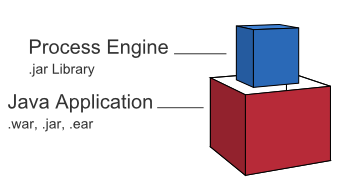

# 写给 Node.js 开发者的 Camunda BPM 简明指南


## 概述

Camunda BPM 是一款用 Java 编写的轻量级工作流引擎，支持 BPMN 2.0、CMMN 1.1、DMN 1.3 标准。


最终用户应用即可以将 Camunda BPM 作为库，将工作流引擎内嵌到独立运行的 Java 应用程序中：



或者在一个 Web 容器中运行 Camunda BPM，同一容器内的多个 Java 应用可以共享这个工作流引擎服务：


也可以将 Camunda BPM 作为独立运行的工作流引擎服务器，应用程序通过 REST API 来调用工作流引擎服务：


由于 Camunda BPM 采用了***无状态工作***的设计，因此它天然支持共享数据库的集群方式：


> Camunda BPM 工作模式详见：[Camunda BPM Introduction - Architecture Overview](https://docs.camunda.org/manual/7.13/introduction/architecture/)

官方文档主要围绕 **“Embbed Process Engine”** 模式，针对 Java 开发进行论述，对 Node.js 开发者来说并不友好。对于 Node.js 开发者来说，最常用 **“Standalone Process Engine Server”** 模式，使用 REST API 调用工作流引擎服务。本文以官方文档为基础，结合实践，阐述 Node.js 开发者如何使用 Camunnda BPM 来进行工作流应用系统开发。


## 安装

从概述的系统结构图中我们知道，Camunda BPM Platform 分为以下几个部分：

- Modeler：建模器应用
- Cockpit、Admin、Tasklist：基于 Web 的管理应用
- Engine：工作流引擎


### Camunda Modeler

Modeler 是一个独立的应用程序，用于 BPMN、DMN、CMMN 建模，有 Windows、macOS、Linux 版本。从[官方页面](https://camunda.com/download/modeler/?__hstc=12929896.cea68860d9fb41d2663c7bcdc5d03ba0.1589530777836.1592797038589.1592802265273.13&__hssc=12929896.5.1592802265273&__hsfp=536848064)下载最新版 Modeler，并安装。


### Camunda BPM 发行版

Camunda BPM 发行版是 Camunda 官方的预编译版本，它包括了：Camunda Web 应用（Cockpit、Admin、Tasklist）和 REST API。 发行版又分为：

- 独立的 Web 应用程序发行版：Camunda BPM Run，基于 Spring 框架的、可独立运行的 Web 应用程序。
- 完整发行版：Camunda BPM Full Distribution，基于 Java Web 容器的发行版，分为：
  - Tomcat 容器发行版
  - JBoss/Wildfly 容器发行版

对于 Node.js 开发者来说，只能采用 Standalone Process Engine Server 的开发模式，使用 REST API 访问工作流引擎服务，因此**以上的发行版均可以满足要求，并无区别**。

> Camunda BPM 又分为：社区版（Community Edition）和企业版（Enterprise Edition）。顾名思义，企业版是需要付费的，而社区版是开源免费的。社区版已能满足绝大部分的需求，以下的讨论仅限于社区版。


### Docker 部署

采用 Docker 部署是最简单、最易于维护的方式，开发者无需熟练掌握 Java 的相关基础知识。

官方给出了三个发行版的 Docker 镜像：

- camunda/camunda-bpm-platform:latest：Tomcat 容器发行版
- camunda/camunda-bpm-platform:wildfly-latest：Wildfly 容器发行版
- camunda/camunda-bpm-platform:run-latest：Camunda BPM Run 发行版

采用任何一个发行版均可满足 Node.js 开发者的需要。

使用 Tomcat 发行版：

```bash
$ docker pull camunda/camunda-bpm-platform:latest
$ docker run -d --name camunda -p 8080:8080 camunda-bpm-platform:latest
```


### 访问入口

Welcome 访问入口：http://localhost:8080/camunda-welcome

也可以直接访问 Web 应用程序：http://localhost:8080/camunda/app

用户名/密码：demo/demo

REST API 根节点：http://localhost:8080/engine-rest

默认 REST API 访问是不需要进行身份认证的。


### 连接数据库

Camunda BPM 默认的数据库是 H2 —— 一个内存数据库，重启服务时，数据会丢失，因此需要连接到一个外部数据库来进行数据持久化。

Camunda BPM 支持的数据库包括：

- MySQL 5.6 / 5.7
- MariaDB 10.0 / 10.2 / 10.3
- Oracle 11g / 12c / 18c / 19c
- IBM DB2 10.5 / 11.1 (excluding IBM z/OS for all versions)
- PostgreSQL 9.4 / 9.6 / 10.4 / 10.7 / 11.1 / 11.2 / 12.2
- Amazon Aurora PostgreSQL compatible with PostgreSQL 9.6 / 10.4 / 10.7
- Microsoft SQL Server 2012/2014/2016/2017
- H2 1.4

PostgreSQL 性能上优于 MySQL 5，且开源、免费，因此采用 PostgreSQL 作为外部数据库，采用 docker-compose 的方式进行部署。

`docker-compose.yaml`：

```yaml
version: "3.7"
services:
  camunda-bpm-platform:
    image: camunda/camunda-bpm-platform:latest
    container_name: camunda-bpm
    depends_on:
      - camunda-db
    environment:
      - DB_DRIVER=org.postgresql.Driver
      - DB_URL=jdbc:postgresql://camunda-db:5432/camunda
      - DB_USERNAME=camunda
      - DB_PASSWORD=camunda
      - WAIT_FOR=camunda-db:5432
    expose:
      - 8080
    ports:
      - 8080:8080

  camunda-db:
    image: postgres:9.6-alpine
    container_name: camunda-db
    environment:
      - POSTGRES_PASSWORD=camunda
      - POSTGRES_USER=camunda
      - POSTGRES_DB=camunda
    expose:
      - 5432
    volumes:
      - camunda_pgdata:/var/lib/postgresql/data
    command: postgres

volumes:
  camunda_pgdata:
```


### 配置身份认证

Camunda BPM REST API 支持 HTTP Basci Authentication（HTTP 基本身份认证）。为了方便开发，Camunda BPM REST API 默认关闭身份认证。但是，在生产环境中，关闭身份认证有安全风险的，需要开启身份认证。

修改 `/conf/web.xml`，添加以下的 Servlet Filter：

```xml
<filter>
  <filter-name>camunda-auth</filter-name>
  <filter-class>
    org.camunda.bpm.engine.rest.security.auth.ProcessEngineAuthenticationFilter
  </filter-class>
  <async-supported>true</async-supported>
  <init-param>
    <param-name>authentication-provider</param-name>
    <param-value>org.camunda.bpm.engine.rest.security.auth.impl.HttpBasicAuthenticationProvider</param-value>
  </init-param>
</filter>
<filter-mapping>
  <filter-name>camunda-auth</filter-name>
  <url-pattern>/*</url-pattern>
</filter-mapping>
```


## 术语

### 流程定义（process definition）

**流程定义**描述了流程的结构。Camunda BPM 使用 BPMN 2.0 标准做为主要的流程建模语言。

定义流程时，需要指定一个 **“key”** 用来标示该流程。流程定义的相关 API，尤其是创建流程实例 API，会用到这个 key。因此，定义一个有明确意义的 key，有助于使用流程定义。

相同 key 的流程定义可以被多次部署，每次部署被视为同一个流程定义的**“新版本”**。

流程定义相关 REST API 的根路径为：`/process-definition`


### 流程实例（process instance）

**流程实例**是流程定义的具体执行。流程实例和流程定义之间的关系，类似于面向对象编程中“类”和“对象”之间的关系 —— 类是定义，对象是类的实例化。

流程实例相关 REST API 的根路径为：`/process-instance`


### 执行（Execution）

如果流程总包含多个执行路径（例如：经过一个“并行网关”之后，流程会分支出多个执行路径），开发者必须能区分当前的执行路径。Camunda BPM 通过**“执行”**来标示一个流程实例中的不同执行路径。

在下图的示例中，两个用户任务（user task）—— *receive payment* 和 *ship order* —— 可能在同一时间被激活。在工作流引擎内部，会在流程实例中创建两个并行的执行。


子流程（Sub Process）和多实例（Multi Instance）也会创建执行。

流程实例中的所有执行是层次化的，树形结构的。流程实例本身也是一个执行，位于执行树的根节点。

执行相关 REST API 的根路径为：`/execution`


### 活动实例（activity instance）

**活动实例**的概念和**执行**的概念很类似，但是又不相同。执行可以视为在流程中移动的 token，有几个 token 就有几个并行的执行；活动实例则是流程中的构件，例如：task、subprocess 等，获得 token 的活动实例，是流程实例当前处理的活动。

活动实例也会构成活动实例树，它能很好的表示一个流程实例的当前状态，例如：当前流程实例有几个待处理的活动实例、每个活动实例的创建时间、指定的处理人是谁等。

获取指定流程实例中活动实例树的 REST API：`/process-instance/{id}/activity-instances`


### 作业和作业定义（job / job definition）

Camunda BPM 中有一个称为**”作业执行器（Job Executor）“**的部件，它是一个调度后台异步工作的部件。例如，工作流引擎处理定时事件（Timer Event）时，并不会长期占用前台进程，而是将当前状态保存到数据库，并创建一个定时器作业，用定时事件来触发流程继续执行。

在部署流程定义时，工作流引擎会为每个活动创建作业定义，并在流程实例中创建作业。

作业及作业定义相关 REST API 的根路径为：`/job`、`/job-definition`


## 基于 Nodejs 的 Camunda BPM 开发流程

```flow
st=>start: Start
A=>operation: 使用 Modeler 进行建模
A1=>condition: 有外部任务？
A2=>operation: 部署外部任务执行器
B=>operation: 部署流程定义
C=>operation: 启动一个流程实例
D=>operation: 用户获取任务列表
E=>operation: 用户完成当前任务
F=>condition: 流程结束？
end=>end

st->A->B->A1
A1(yes)->A2->C
A1(no)->C
C->D->E->F
F(no)->D
F(yes)->end
```


## 快速入门

本节基于官方的快速入门教程（[Get Started with Camunda](https://docs.camunda.org/get-started/)），旨在快速浏览一下 Camunda BPM 开发的主要概念。


### BPMN 建模


### 部署流程定义


### 基于 Nodejs 实现自动化任务


### 启动流程实例


### 获取用户任务列表


### 完成当前用户任务


### 使用决策表实现自动化任务


### 小结


## BPMN 建模

Camunda 官方给出了 3 篇文档来解说 BPMN 建模，**建议完整阅读这 3 篇文档**。

- [BPMN 新手教程](https://camunda.com/bpmn/)：该教程通过三个简单的例子来帮助初学者建立 BPMN 建模的主要概念。
- [BPMN 建模参考](https://camunda.com/bpmn/reference/)：该参考解释了 BPMN 建模中用到的所有符号含义及主要用法。
- [BPMN 建模示例、模版、及最佳实践](https://camunda.com/bpmn/examples/)：给出了很多 BPMN 建模的例子，比逐一解说这些例子的优缺点，指出规范的建模方法。其中很多示例可以直接做为模版用于建模。

本文对最常用的几个建模构件进行分析和示例，再次强烈建议完整阅读以上 3 篇文档。

> **注意：BPMN 2.0 是一个标准，Camunda BPM 是这个标准的实现。本节的主题是对标准本身的解释，示例用到了 Camunda BPM。**


### 泳池和泳道（pool / lane）

泳池和泳道主要为了表达流程间的协作关系，以及流程内各角色之间的协作关系。它们只起到建模语义学的作用，对工作流引擎的实际运作并无直接影响。

通常，泳道用于表达人或角色，例如：

- 组织机构的某个职位，比如：会计
- 组织机构的某个角色，比如：安全员
- 通用的角色，比如：顾客
- 部门，比如：销售部
- IT 应用系统，比如：CRM 系统

泳道用于表达流程，例如：订购流程、供应流程等。

流程应该按逻辑关系进行拆分。比如：“披萨消费流程”可以拆分成：“披萨订购流程”和“披萨供应流程”。这两个流程分属不同的“组织” —— 订购的主体是客户，供应的主体是披萨店。两者并不是紧密联系的 —— 客户可以选择不同的披萨店 —— 因此应该分别建模（归属不同的泳池）。

流程和流程之间的协作，用泳池之间的消息流来连接。比如：“订购流程” 和 “供应流程” 之间有多个消息流 —— 订单、发货提醒、收货、收款等。

> Camunda Modeler 中
>
> - 没有添加泳池时，整张图就是一个“流程”（Process）。
> - 添加泳池后，每个泳池是一个流程，整张图则是一个“协作”（Collaboration）。
> - 一旦添加了泳池，所有的构件（Event、Activity等）就只能摆放在泳池中，因为构件只能属于“流程”，而不能独立于”协作“。
> - **注意：删除泳池，等于删除流程，所有的构件和逻辑连接都会同时被删除！**


### 活动（Activity）

活动包括 5 大类：任务（Task）、子流程（Subprocess）、调用活动（Call Activity）、事件子流程（Event Subprocess）、事物（Transaction）。其符号如下：


### 任务（Task）

任务代表单一工作单元，它不会也不能被分解为更深层次上的业务流程细节。

为了工程的目的，在 Camunda BPM 中，任务又被细分为 8 种类型：


- **未定义（undefined）**：仅用于建模，在工作流引擎中没有实际作用。
- **人工任务（manual）**：用于对人工操作进行建模，这里的“人工操作”是指和工作流引擎无关的操作，例如：给客户打电话、在文件夹查找文件等。这一任务类别会直接被工作流引擎跳过，对工作流引擎的实际工作不会产生任何影响，仅仅起到建模语义学的作用。
- **用户任务（user）**：和 manual 类似，也是对人工操作进行建模，但是这里的人工操作是工作流引擎指派的操作，例如：审核请假申请、处理技术支持请求等。工作流引擎会在 user task 的地方暂停，等待用户确认完成任务后，才继续往下执行。通常，用户会获取与自己相关的 user task 列表、读取任务变量、输出一些数据到任务变量、并确认完成任务。
- **接收消息任务（receive）**：这是捕获消息事件（catch message event）的另一种表示方式，通常使用捕获消息事件建模，而不会用它。
- **发送消息任务（send）**：发送消息任务将调用外部服务，向消息队列发送消息。在 Camunda BPM 中，其实现方式与 Service Task 完全相同，只是表示符号不同，起到建模语义学的作用。
- **脚本任务（script）**：可以通过内置脚本来完成一些自动化任务。Camunda BPM 支持的脚本类型包括：Groovy、Javascript、JRuby 和 Jython。
- **服务任务（service）**：通过调用外部服务来完成一些自动化任务。通常外部服务是 Web Service，但是 Camunda BPM 采用了另一种方案来实现外部服务，在外部服务一节进行讨论。
- **业务规则任务（business rule）**：根据业务规则进行决策的任务。在 Camunda BPM 中可以调用 DMN 引擎，或外部服务来进行业务决策。


### 任务标记（Task Markers）

任务可以被标记为：循环（loop）、多实例（multiple instance）、补偿（compensations）。


### 循环（Loop）

重复执行任务。例如下面的示例：我们向客人推荐各种菜肴，直到所有人都同意为止；然后，可以准备饭菜。


在 Camunda BPM 中，尚未支持循环标记，解决方案是对循环进行显示建模：


### 多实例（Multiple Instance）

在有些情况下，有些任务的执行可以是并行的，以提高效率。例如下面的示例：公寓里的每个人独立进行点餐（并行的），直到所有人决定了披萨类型；然后，可以订披萨。


多实例和循环类似，也是重复特定步骤的方法。在 Camunda BPM 中，多实例与 `for each` 结构匹配：它允许为给定集合中的每个项目依次或并行地执行某个步骤。

一下活动（Activity）可以标记为多实例：

- Service Task
- Send Task
- User Task
- Business Rule Task
- Script Task
- Receive Task
- Manual Task
- Subprocess
- Call Activity
- Transaction Subprocess

网关（Gateway）和事件（Event）不能标记为多实例。

在 Camunda BPM 中，多实例被进一步分成：并行执行的多实例（用三条垂直线表示）和顺序执行的多实例（用三个水平线来表示）。


> 进一步分析可知：顺序执行的多实例实质上就是一种循环。与循环相比，顺序执行的多实例要求明确循环的次数（`for each` 结构需要在一开始就确定循环集合），而循环则对应（`do...while` 或 `while...do` 结构，无需在循环开始时，确定循环的大小）。


### 补偿

用一个活动改变另一个活动的结果，称之为补偿。补偿处理流程不包含在常规流程中，仅在补偿事件发生时被执行。因此，它仅通过关联而不是按顺序流程集成在流程图中。


### 网关

网关用来控制流程的执行流向。有 4 种网关：排他网关（Exclusive Gateway）、并行网关（Parallel Gateway）、包容网关（Inclusive Gateway）、事件网关（Event-based Gateway）。


### 排他网关（Exclusive Gateway）

排他网关用于在流程中对决策进行建模。简单来说，就是 `if...else if...else` 结构（与 `switch...case` 结构不同）：

- 按照定义顺序评估所有的传出序列，选择条件评估为“true”的序列以继续该流程；
- 如果有多个序列流评估为“true”，仅选择 XML 中定义的第一个序列以继续流程；
- 如果没有条件评估为“true”，这将导致运行时异常，流程将停在上一个活动；
- 如果定义了默认流，则允许在其它条件都不满足的情况下，继续流程。


### 并行网关（Parallel Gateway）

并行网关用于流程中的并发活动建模，它允许分支进入多个执行路径。

- fork：并行执行所有传出序列，为每个序列创建一个并发执行。
- join：所有到达并行网关的并发执行都在网关处等待，直到每个传入序列都执行完毕，然后继续后面的流程。


> 并行网关并不需要“平衡”，即，fork 并行网关和 join 并行网关数量并不需要相同。


### 包容网关（Inclusive Gateway）

包容网关可以视为排他网关和并行网关的组合、语法糖：如果传出序列条件有多个“true”，则这些序列将并行执行。


### 事件网关（Event-based Gateway）

事件网关对基于事件的决策进行建模。以下面的例子来说明：


当执行到事件网关时，流程执行被挂起。流程实例订阅了 `Alter` 事件，并创建了一个计时器，该计时器在 10 分钟后触发。这将导致工作流引擎等待 10 分钟 `Alter` 事件。如果 `Alter` 在 10 分钟内发生，则取消计时器，并执行后续流程；如果未触发 `Alter`，则 10 分钟后，计时器事件触发后续流程，并取消对 `Alter` 信号的订阅。


### 事件的术语（Event）

任务和网关时到目前为止我们已经知道的三个流程元素中的两个：事情（任务）必须在某些情况下（网关）完成。但仍然缺少了关键的流程元素 —— 会发生什么事儿（事件）。

**捕获事件**是定义了触发器的事件。当事件发生时，可能导致：

- 开始流程
- 继续流程
- 终止当前流程或子流程的执行
- 执行当前流程或子流程的另一条分支路径

**抛出事件**是触发自身的事件。抛出事件可以：

- 在流程中触发
- 在流程结束时触发

**附加中间事件**放置在活动的边界处，当它发生时，会中断当前活动。


- 流程运行到 task 1，该任务开始执行。
- 在处理 task 1 时，发生 event 1，则立即取消 task 1，并执行 task 3。
- 如果直到 task 1 处理完毕，event 1 都没有发生，则执行 task 2。
- 一旦 task 1 处理完毕，则不再监听 event 1。此时，无论 event 1 是否发生，都不会执行 task 3。

**非中断中间事件**。有些情况下，不希望中间事件导致活动被取消，因此引入了非中断中间事件的概念。


- 此时，在处理 task 1 时，发生 event 1，task 1 不会被取消，而会执行完成，同时执行 task 3。


### 事件的分类

Camunda BPM 中定义了 10 种事件：空白事件（None）、消息事件（Message）、定时器事件（Timer）、条件事件（Conditional）、链接事件（Link）、信号事件（Signal）、错误事件（Error）、升级事件（Escalation）、终止事件（Terminal）、补偿与取消事件（Compensation and Cancel）。

> Camunda BPM 实现的事件类型略少于 BPMN 2.0 标准定义的 13 种事件。其中，Multiple 和 Multiple Parallel 事件尚未实现；Compensation 和 Cancel 事件合并为 Compensation 事件。


### 开始事件（Start Event）和结束事件（End Event）

开始事件和结束事件并不是 BPMN 定义的事件类型，它们只是按照流程定义中功能来命名的事件。

流程和子流程都必须从开始事件开始，以结束事件结束。

开始事件可以是：

- 空白事件
- 定时器事件
- 消息事件
- 信号事件
- 条件事件

结束事件可以是：

- 空白事件
- 消息事件
- 信号事件
- 错误事件
- 升级事件
- 终止事件
- 补偿事件

简单的流程定义，总是从空白的开始事件开始，以空白的结束事件结束。


### 空白事件（None）

空白事件表示什么都没有指定：无条件启动和无条件结束。


### 消息事件（Message）

消息事件时引用命名消息的事件。每个消息都有名称和有效载荷（附加数据）。与信号事件不同，消息事件始终是针对某个收件人的。


### 子流程

子流程用于封装复杂性。在一个复杂的流程中应用子流程，可以让设计者关注于整体流程，按照自上而下，或者自下而上的层次设计方法来设计流程。

在 Camunda BPM 中，有两种子流程的表示方法：

- 子流程在父流程的流程图中直接进行定义，称之为”嵌入式子流程（Subprocess）“
- 子流程在另一个流程图中定义，父流程调用外部定义的子流程，称之为“调用活动（Call Activity）”


### 嵌入式子流程

应用嵌入式子流程，需要注意：

- 子流程允许分层建模。
- Camunda Modeler 中一旦展开了子流程，就无法再折叠。
- 子流程为事件（Event）创建了新的作用域 —— 子流程中的事件仅限于子流程内部，在子流程执行期间引发的事件可由子流程边界上的边界事件捕获。
- 子流程只能有一个无条件开始事件，不允许其它的开始事件类型。子流程必须至少有一个结束事件。
- 工作流不能跨越子流程边界。

> BPMN 2.0 规范允许省略子流程中的开始和结束事件，但是目前 Camunda BPM 尚不支持该功能。


如果展开了子流程，则该子流程的步骤将显示在子流程边界内：


使用子流程的主要原因之一是为事件定义范围。例如下面的示例：如果收到吃饭邀请，那么将取消烹饪过程；但是，如果已经在吃饭，则不再对邀请作出反应。用专业术语来说：吃饭邀请事件的范围是烹饪子流程，只能在子流程处于活动状态时接收消息。


### 调用活动

调用活动主要用于具有可重用的流程定义。

当流程执行达到调用活动时，将创建一个新的流程实例，该实例用于执行子流程。主流程实例等待子流程完全借宿，然后再继续原始流程。

由于调用活动可以被多个父流程调用，而嵌入式子流程则只和一个父流程的上下文相关，因此在处理输入输出变量上，两者有所不同：

- 嵌入式子流程可以直接读取父流程的所有数据
- 调用活动由于启动了一个新的流程实例，因此需要通过变量映射 —— 将父流程的变量复制到调用活动中，在调用活动结束时再复制回主流程 —— 来访问父流程的变量。

> 在配置调用活动时，可以将父流程中的所有流程变量复制到调用活动中，并保持同名。
>
> `Variables -> In Mapping -> all`，`Variables -> Out Mapping -> all`


## REST API 中的变量类型

在 REST API 中引用流程变量的格式如下：

```json
{
  "type": "String",
  "value": "Some value",
  "valueInfo": {}
}
```

REST API 支持以下几种格式：


> **注意：**在 REST API 中，type 的名字以大写字母开头，例如：`string` 类型，应写作 `String`。


### 原生数据类型（Primitive Types）

Camunda BPM 是基于 Java 的，因此**原生数据类型**是指不需要额外的元数据，直接存储在标准 Java 类中的数据类型。包括：boolean（布尔值）、bytes（字节数组）、short（短整型）、integer（整型）、long（长整型）、double（双精度浮点数）、string（字符串）、null（空）等 9 种类型。

原生数据类型无需设置 `valueInfo` 字段。

对 string、boolean、null 无需设置 `type` 字段，Camunda BPM 会自行推断类型。

**原生数据类型在 API 调用种，可以直接作为搜索条件对流程实例进行查询。**

> **String 类型的长度限制：**
>
> string 在数据库中对应了 `varchar` 类型，其最大长度为 4000 字节。UTF-8 编码下，每个汉字占用 3 个字节，也就是约 1300 个汉字。


### 文件类型（File Type）

（还不知道怎么用，似乎是可以 Upload / Download 一个文件）


### 对象类型（Object Type）

对象类型是自定义类型。实现对象类型的实质是把 Java 不认识的数据类型（自定义数据类型。JSON 对 Java 来说，也是自定义数据类型）映射到某个 Java 类，以实现对该自定义数据类型的操作。

对 Nodejs 开发者来说，不会在工作流引擎服务端自定义 Java 类，只能使用工作流引擎服务端内置的 Java 类，因此对象类型实际上只会用于传递通用的 JSON / Array 数据。其中：

- JSON 数据对应了 `java.util.LinkedHashMap` 类；
- Array 数据对应了 `java.util.ArrayList` 类。

在传递 JSON / Array 时，不需要设定 `type` 和 `valueInfo` 字段，Camunda BPM 会自行推断类型。

例如，可以使用以下方式定义 JSON 数据：

```json
{
  "value": {
    "country": "China",
    "city": "北京"
  }
}
```

定义 Array 数据：

```json
{
  "value": ["China", "北京"]
}
```


### JSON / XML 类型

Camunda BPM 透过 camunda-spin 来支持这两种类型，在发行版中默认加载了 camunda-spin。

本质上，JSON / XML 类型等同于映射为 `org.camunda.spin.Spin.S` 类的对象类型数据。

camunda-spin 接收符合  JSON / XML 规范格式的 string，添加了相应的 API 来将 string 转换成 Spin 对象，通过操作 Spin 对象来操作 JSON / XML。有点儿类似于 Javascript  中使用 `JSON.stringify()` 将 JSON 序列化为 String 用于传输、存储；通过 `JSON.parse()` 将 String 转换成 JSON 格式进行读写。

JSON 数据操作过程如下：

- REST API Client 将 JSON 格式化为 string，并将其传递到工作流引擎服务器端；
- 工作流引擎服务器端使用 `org.camunda.spin.Spin.JSON` 类将 string 转换为 `SpinJsonNode` 对象（object），`SpinJsonNode` 对象等同于 Javascript 中的 JSON 对象，只是提供的 API 与 Javascript JSON 对象的内置方法不同；
- 在响应 REST API Client 的请求时，工作流引擎服务器端会将 `SpinJsonNode` 对象转换成 string，并发送到客户端。

- 对 JSON 类型，工作流引擎服务端处理 JSON 的类名为：`org.camunda.spin.Spin.JSON`。

- 对 XML 类型，工作流引擎服务端处理 XML 的类名为：`org.camunda.spin.Spin.XML`。

在使用 JSON / XML 类型时，不需要设定 `valueInfo` 字段，Camunda BPM 会自行推断类型。

例如，可以使用以下方式定义 JSON 数据：

```json
{
  "type": "Json",
  "value": "{\"country\": \"China\", \"city\": \"北京\"}"
}

// 注意："value"的值是字符串，而不是 JSON 格式数据
```

> 对 Nodejs 开发者来说，Object Type 和 JSON Type 都可以处理 JSON 数据，看上去使用 Object Type 更直接，但是，**推荐使用 JSON 类型！**因为在工作流引擎服务端的 Expression 和 Script 中，可以使用 Spin API 直接引用 JSON 变量，而无法引用 Object 变量。例如，可以直接引用 JSON 作为 BPMN 中的转移条件：
>
> ```xml
> <!--
>   假设已经定义了流程变量：
> 	address: {
> 		"country": "China",
> 		"city": "北京"
> 	}
> -->
> <sequenceFlow>
>   <conditionExpression xsi:type="bpmn:tFormalExpression" language="javascript">
>     address.prop("city").value() === "北京"
>   </conditionExpression>
> </sequenceFlow>
> ```


### 在 Javascript 脚本中使用 JSON 类型

> **注意：**这里提到的 Javascript 脚本是 Camunda BPM 工作流引擎服务器中 BPMN 构件引用的 Javascript 脚本，而不是独立的 Nodejs 程序，或者 Web 页面内嵌的 Javascript 脚本。

**在服务器端的脚本中，本质上是调用 `SpinJsonNode` 的 API 来操作 JSON 数据**。

具体的 API 使用方法，参阅官方指南 —— [Reference - Spin Dataformats - JSON](https://docs.camunda.org/manual/7.13/reference/spin/json/)


### 序列化和反序列化（Serialization / Deserialization）

对象类型数据被映射为某个 Java 类，由于 Java 类无法保存到数据库，因此需要通过序列化将 Java 类转换成 string 进行保存；从数据库中读出时，则需要通过反序列化操作来恢复数据。

工作流引擎通过 `java.io.Serializable` 来完成对象序列化，序列化的结果是**“不可读的”**字符串（所谓**不可读**是指：字符串没有明显的含义，类似 Base64 编码）。

REST API 将 JSON / Array 数据传递到工作流引擎服务器时，工作流引擎会自动完成序列化；响应 REST API 请求时，Client 可以选择是否让工作流引擎服务器完成反序列化。

REST API 读出对象类型流程数据时，如果不执行反序列化，则读出内容是无法解读的。默认情况下，工作流引擎自动执行反序列化。

REST API 在操作 JSON / XML 类型数据时，Client 传出的 value 就是 string 类型，虽然在服务器端被映射成了 Spin 类，但是在回传（响应客户端请求）时，仍然应该回传 string，而不应反序列化。此时，可以通过 `deserializationValue=false` 参数，要求服务器端不执行反序列化。


## 流程变量的作用域和可见性


一个流程实例的结构如上图。流程实例本身就是一个执行（execution），根执行有两个子执行，每个子执行又各自创建了一个任务（task，活动实例）。这个结构定义了 5 个流程变量定义域，它们构成了父-子关系。父定义域的变量可以被子定义域访问，而子定义域的变量不能为父定义域以及相邻的子定义域访问。


在上图示例中，*Task1* 可以访问到变量 *customer* 和本地的变量 *worker*（value: "Fozzie"），*Task2* 则可以访问到变量 *customer* 和本地的变量 *worker*（value: "Gonzo"）。*Task1* 和 *Task2* 都可以对 *customer* 进行修改，并立即被另一个 task 看到修改结果。


本地变量会屏蔽父定义域的变量。在上图示例中，*Task1* 能访问到两个本地变量 *customer* 和 *worker*，而父定义域的变量 *customer* 被本地变量屏蔽了。


## 使用 REST API 操作流程变量

流程实例（process instance）、执行（execution）、任务（task）均可操作变量。

变量的操作包括：

- Get List —— 获取所有的变量
- Get —— 获取一个变量
- Update —— 添加、更新一个变量
- Delete —— 删除一个变量
- Modify —— 更新并删除一组变量。更新操作在删除操作之前，意味着如果同时更新/删除一个变量，最终结果是该变量被删除了。

和变量的作用域结合起来，共有 4 组 API 用于操作流程变量：

- 流程实例的变量操作，相关 REST API 根节点为 `/process-instance/{id}/variables`。

  流程实例是执行树的根节点，因此流程实例的变量操作对该实例来说是全局的，也就是所有的执行和任务均可见这一组变量。

- 执行的本地变量操作，相关 REST API 根节点为 `/execution/{id}/localVariables`。

  执行类似一个 token，本身并不和具体的操作相关，因此无需访问流程实例的变量。但是，本身可能需要为执行树上的活动提供上下文，因此需要对本地变量进行操作。

- 任务的变量操作，相关 REST API 根节点为 `/task/{id}/variables`。

  任务变量指该任务可见的所有变量，包括：流程实例变量、上下文定义的变量（执行的本地变量）、任务的本地变量。**注意：**本地变量会屏蔽父定义域中的同名变量。

- 任务的本地变量操作，相关 REST API 根节点为 `/task/{id}/localVariables`。

具体的 REST API 使用方法，参阅官方指南 —— [Reference - Rest Api](https://docs.camunda.org/manual/7.13/reference/rest/)


