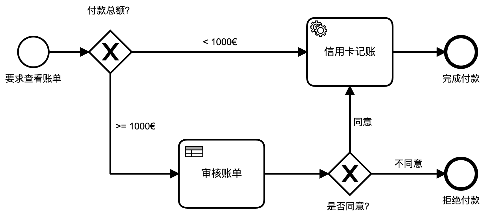

# Camunda 快速入门


## 下载和安装

使用 Docker 部署最方便。

```bash
$ docker pull camunda/camunda-bpm-platform:latest
$ docker run -d --rm -p 8080:8080 camunda/camunda-bpm-platform:latest
```


## 流程设计

使用 Camunda Modeler 设计一个简单流程，并使用 Node.JS 来执行流程中的自动化步骤。

### 创建一个付款流程



- Start Evnet：所有流程都启动于“开始事件”。
  - 设置名字：**要求付款**
- End Event：所有流程都终止于“结束事件”。
  - 设置名字：**收到付款**
- Task：“任务”是**流程活动（Activity）**的一种，它具体又可分为：**User Task**、**Service Task** 等等。
  - 设置名字：**信用卡付款**
  - 设置 Task 类型：**Service Task**。Service Task 是对**“自动执行步骤”**的建模。
  - 设置 Service Task 的实现方法（Details -> Implementation）：**External**。外部实现是指：Service Task 会调用一个外部服务来实现自动化步骤。Camunda 是用 Java 实现的，在纯 Java 环境中（例如：Spring Boot），可以选择使用 Java Class 来实现自动化步骤。对于 Node.JS 开发者，Camunda 提供了自动化步骤的**外部实现**方式，并封装了 **camunda-external-task-client-js** 库，来帮助 Node.JS 开发者方便的实现外部服务。
  - 设置外部服务名称：**charge-card**
- Process：“流程”。点击空白处，对流程进行设置。
  - 设置 Id：**payment-retrieval**。和 Task 不一样，Task Id 只是流程引擎使用，可以由 Modeler 自动生成一个唯一的 Id，无需手动修改。流程 Id 则在用户部署、创建、查询、操作流程时都会用到。因此给流程 Id 起一个有明确意义、容易记忆的名字非常重要。
    - 流程 Id 是否支持中文，尚未测试。但是考虑到兼容性，在 rest api、function parameter 中使用中文，可能导致未知的问题，因此不要使用中文。
    - 考虑到 rest api 中会引用流程 Id，因此 Id 应遵从 **“kebab-case”** 命名规范，即：所有的字母都小写；单词和单词之间使用 **-** 进行连接。例如："the-quick-brown-fox-jumps-over-the-lazy-dog"

### 使用 Node.JS 实现一个外部服务执行者（Worker）

#### External Task 的实现机制

Camunda External Service Task 采用了和 Flowable HTTP Service Task 完全不一样的实现机制。

Flowable HTTP Service Task 的实现非常直接：

- 外部的 HTTP Service 是一个 HTTP server；
- Flowable 引擎在执行 HTTP Service Task 时，将向 HTTP Service 发出一个 REST API Call；
- Service 执行完毕后，返回结果。

Camunda External Service Task 则采用了完全不同的实现方式：

- Camunda 引擎生成一个 External Task List；
- 外部 Worker 启动时，将向 Camunda 订阅（subscribe）某个 External Task Topic（也就是绑定在某个 External Task 上）；
- Camunda 引擎在执行 External Service Task 时，会向指定的 External Task Topic 发出请求，该请求被转发给绑定的 Worker；
- Worker 执行完毕后，返回结果。


与 Flowable 不同，Camunda 的实现方式中，Worker 是一个 HTTP Client，而不是一个 HTTP Server。Worker 向 Camunda 发出注册请求，在引擎没有调用 External Service 的时候，Worker 会休眠，直到：

- 有 External Task 的调用，Worker 将执行并返回结果。
- Timeout，Worker 将重新连接。

这种方式称为：Long Polling（长轮询），能有效的提高通信效率。


#### 添加 camunda-external-task-client-js 库

[Camunda External Task Client JS](https://github.com/camunda/camunda-external-task-client-js) 是 Camunda 官方提供的，用于实现 Long Polling External Task Client 的 JS 库。

```bash
$ npm install camunda-external-task-client-js --save
```

#### Node.JS 实现

```javascript
const { Client, logger } = require('camunda-external-task-client-js');

// configuration for the Client:
//  - 'baseUrl': url to the Process Engine
//  - 'logger': utility to automatically log important events
//  - 'asyncResponseTimeout': long polling timeout (then a new request will be issued)
const config = { baseUrl: 'http://localhost:8080/engine-rest', use: logger, asyncResponseTimeout: 10000 };

// create a Client instance with custom configuration
const client = new Client(config);

// susbscribe to the topic: 'charge-card'
client.subscribe('charge-card', async function({ task, taskService }) {
  // Put your business logic here

  // Get a process variable
  const amount = task.variables.get('amount');
  const item = task.variables.get('item');

  console.log(`Charging credit card with an amount of ${amount}€ for the item '${item}'...`);

  // Complete the task
  await taskService.complete(task);
});
```

上述代码没有做什么实质性的操作，仅仅读取、显示了 Task 中的变量数据。

> 在启动 Camunda BPM Platform 和部署流程之前，启动 Worker 也没问题，但是会报错，例如：
>
> ```bash
> $ node worker.js
> ✓ subscribed to topic charge-card
> ✖ polling failed with RequestError: connect ECONNREFUSED 127.0.0.1:8080
> ✖ polling failed with RequestError: connect ECONNREFUSED 127.0.0.1:8080
> ✖ polling failed with RequestError: connect ECONNREFUSED 127.0.0.1:8080
> ```


## 部署流程

