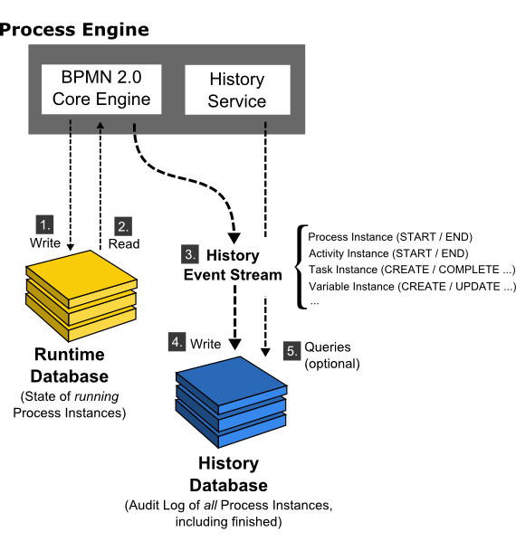

# Camunda 用户指南

本指南面向 Node.JS 开发人员，节选自 [Camunda 官方文档](https://docs.camunda.org/manual/7.13/)，主要设计系统架构、REST API 的使用等。

## 流程引擎 API


### RespositoryService

此服务用于管理**“流程定义”**和**“部署”**。

- **流程定义**：用 BPMN 2.0 描述的流程。

- **部署**：可以含有一个或多个流程定义。

此类服务还包括：

- 查询引擎已知的部署和流程定义
- 挂起并激活流程定义。挂起表示无法对其进行进一步的操作，而激活则是重新允许操作流程定义。
- 检索各种资源。例如：部署中包含的文件或引擎自动生成的流程图。

### RuntimeService

此服务用于：

- 启动流程定义的新**流程实例**。

  流程定义定义了流程中不同步骤的结构和行为。流程实例则是流程定义的执行。对于每个流程定义，通常由多个实例同时运行。

- 检索和存储**流程变量**。

  流程变量是特定于给定流程实例的数据，可由流程中的各种部件使用。例如，排他网关通常使用流程变量来确定选择哪个路径继续该流程。

- 查询流程实例和流程实例的**执行**。

  这里的“执行”是 Camunda 中的术语，表示 BPMN 2.0 的 token 概念。基本上，“执行”是指向流程实例当前所在位置的指针。

- 流程实例等待外部触发器信号并继续流程，也要使用 RuntimeService。

### TaskService

任务（Task）是指流程中需要“人”执行的步骤，这是流程引擎的核心。TaskService 为任务提供相关服务。

- 查询分配给用户或组的任务（获取任务列表）

- 创建新的独立任务 —— 和流程实例无关的任务。

- 将任务指派给某个用户、某个组、或几个用户/组。

- 声明、完成任务。

  声明是指某人认领任务，成为该任务的执行人。完成意味着“完成任务的工作”，通常会提交一些 Form 数据。

### IdentityService

此服务用于用户和组的管理 —— 创建、更新、删除、查询。

**注意：**实际上，核心引擎在运行时不对用户进行任何检查！也就是说，可以将任务分配给任何用户，引擎不会验证系统是否知道该用户。用户的管理可以完全由外部的用户管理系统接管，例如：LDAP、Active Directory 等。

### HistoryService

在执行流程时，流程引擎可以保存很多数据（这是可配置的）。例如：流程实例的启动时间、谁执行了哪些任务、完成任务所花的时间、每个流程实例遵循的路径等。该服务主要用于查询这些数据。

### ManagementService

此服务用于检索有关数据库表和表元数据的信息。通常开发人员不需要用到它。

### FilterService

允许创建和管理 Filter。Filter 是存储的查询，例如：任务列表查询 Filter。

### DecisionService

业务规则服务，用于实现独立于流程定义的业务规则。

### FormService

引入了启动表单和任务表单的概念，该服务以一种简单的方式在流程定义中定义数据表单。

### ExternalTaskService

提供了访问外部任务实例的功能。外部任务表示独立于流程引擎处理的工作项。

### CaseService

处理启动案例定义的新案例实例，并管理案例执行的生命周期，检索和更新案例实例的过程变量。它实现了 CMNN 标准。


## 查询 API

REST Query API 可以用于查询引擎实体，如 ProcessInstances、Tasks 等。

### 限制最大查询结果数

在不限制最大结果书的情况下，查询大量结果会导致大量内存消耗，甚至导致内存不足异常。在使用 REST API 进行查询时，需要配置 queryMaxResultsLimit 参数来限制最大结果数。

#### 禁止使用的查询方式

- 在**分页查询**时不要超出最大结果数的限制。
- 在执行同步查询时，如果涉及的流程实例数超过最大结果数，则应该使用“批处理操作”（Batch Operation）。

#### 有限制使用的查询方式

- 通过 REST API 执行一个静态查询。

### 分页查询

分页允许配置查询所检索的最大结果数以及第一个结果的位置（索引）。

```
GET /task?assignee=kermit&processVariables=orderId_eq_0815&firstResult=20&maxResults=50
```

上述查询从索引（firstResult）为 20 的结果开始检索最大不超过（maxResults） 50 的结果。

### 或（OR）查询

查询 API 默认查询条件是“与”（AND）关系的。可以通过 OR 查询，将查询条件用 OR 表达式链接起来。REST API 中通过 orQueries 参数实现 OR 查询。


## 流程引擎的概念

本节解释一些流程引擎的核心概念，理解这些基础知识会使你更容易理解流程引擎 API 的用法。

### 流程定义

**流程定义**定义了流程的结构，您可以说流程定义就是流程。Camunda BPM 使用 BPMN 2.0 作为主要建模语言来对流程定义进行建模。

> BPMN 2.0 参考手册
>
> - 《BPMN 2.0 建模参考手册》，介绍了 BPMN 2.0 的基础知识，并帮助您开始建模过程。
> - 《BPMN 2.0 实现参考手册》，涵盖了 BPMN 2.0 中各种构件的具体实现。如果要实现和执行 BPMN 流程，应该查阅该手册。

在 Camunda BPM 中，可以将流程以 BPMN 2.0 XML 文件格式部署到流程引擎。XML 文件将被解析并转换为流程定义结构图结构，该图结构由流程引擎执行。

#### 查询流程定义

使用 `GET /process-definition` REST API 来查询流程定义。

#### 键（key）和版本（version）

流程定义的键是流程的逻辑标识符。它在整个 API 中被使用，最主要用于启动流程实例。在 BPMN 2.0 XML 文件中 <process ...> 的属性 id 就是流程定义的键，也就是 Modeler 中的 Process.Id。

如果使用相同的键部署多个流程，则流程引擎会将它们视为同一个流程定义的多个版本。

#### 暂停（Suspend）流程定义

暂停流程定义会暂时禁用它，即在暂停过程中无法实例化该流程定义。

可以通过激活流程定义来取消暂停。

### 流程实例

**流程实例**是流程定义的执行。流程实例与流程定义之间的关系与面向对象编程中*对象*和*类*之间的关系相同。*类*是定义，*对象*是实例。

流程引擎负责创建流程实例并管理其状态。

#### 启动流程实例

通常使用 `POST /process-definition/key/{key}/start` 来启动流程定义的最新版本。

#### 查询流程实例

使用 `GET /porcess-instance` 来查询流程实例。

> 如果结果数很大，可以先使用 `GET /process-instance/count` 来获取流程实例数，以方便分页查询。

#### 与流程实例互动

#### 挂起流程实例

### 执行（Execution）

### 活动（Activity）

### 作业（Job）和作业定义

Camunda BPM 中包括一个名为 *Job Executor* 的组件。它是一个调度组件，负责执行异步后台工作。例如一个计时器事件：只要流程引擎到达计时器事件，它将停止执行，保存当前状态到数据库，并创建一个作业（Job）以在将来恢复执行。作业的到期日期是使用 BPMN XML 中提供的计时器表达式计算出来的。

部署流程后，流程引擎会为流程中的每个活动创建作业定义，这将在运行时创建作业。

您可以查询有关计时器和进程中异步继续的信息。


## 流程变量

本节将描述流程中的变量概念。

### 变量的作用域和可见性

### Set 和 Get 变量 - 概述

### JSON 值

JSON 不是 Java 的标准变量类型，因此需要通过 Camunda-spin-core 插件来操控 JSON 变量。其基本原理是：将 JSON 变量转换为 string 给 Java，将 string 转换为 JSON 变量给应用程序。

在 Docker 部署的 Camunda BPM 中，camunda-spin-core 插件已经预安装好了。


## 表达式

Camunda BPM 支持统一表达语言（Unified Expression Language，EL）。

### 表达式中变量和函数的可用性

#### 流程变量

当前作用域的所有流程变量都可以在表达式内部直接使用。例如：条件序列流可以直接检查变量值。

#### 内部上下文变量

| 变量名              | 上下文                                                       |
| ------------------- | ------------------------------------------------------------ |
| execution           | 在 BPMN 执行上下文中可用，例如：Service Task、Execution Listener 等 |
| task                | 在任务上下文中可用                                           |
| caseExecution       | 在 CMMN 执行上下文中可用                                     |
| authenticatedUserId | 当前经过身份验证的用户 ID。如果没有经过 IdentityService 设置当前认证，则返回 null。 |

### 内置 camunda-spin 功能

可以处理自定义 Type 的 JSON 数据。


## 脚本

Camunda BPM 支持 Javascript 脚本。


## 外部任务


## 流程的版本


## 历史记录和实践日志审计



### 历史记录的清理策略

为了使用历史记录清理，您必须确定在两个可用的历史记录清理策略中选定一个：

- 基于删除时间的策略（默认策略）
- 基于结束时间的策略


## 流程中的事务机制


## 流程引擎插件 

流程引擎插件用于扩展流程引擎的功能。内置的流程引擎插件包括：

- LDAP 身份服务插件
- 管理员授权插件
- 流程应用程序事件监听器插件


## 流程引擎中的决策

Camunda BPM 集成了 DMN 引擎来运行业务决策。DMN 也支持历史记录查询。


## 批处理


## Camunda BPM Run

Camunda BPM Run 是 Camunda BPM Platform 的预打包发行版，包括：Camunda Webapp（Cockpit，Tasklist，Admin）和 REST API。

Run 意图提供一个完整的 Camunda BPM 发行版，其发行版具有简单但功能强大的配置机制，无论开发者对 Java 或应用服务器是否有了解，都可以使用它。

有关分步安装指南，请参阅**安装指南**。


## 数据格式（XML，JSON，和其它）

由于 JSON 不是 Java 的内置数据格式，因此 Camunda 需要通过 camunda-engine-plugin-spin 插件来处理 JSON 数据。

通过 spin 插件，可以：

- 在 EL（Expression Language）中直接使用 JSON
- 在 脚本（Scripting）中直接使用 JSON
- 在 Java 中添加内置的 JSON 类型
- 序列化过程变量（序列化是指：将内存中的变量，序列化成比特流，用于持久化。简单来说，就是保存变量到文件或数据库）
- 自定义序列化


## 认证方式

为了方便开发，默认关闭 REST API 的认证。当在产品部署时，需要开启认证。可以通过 REST API 开启认证。