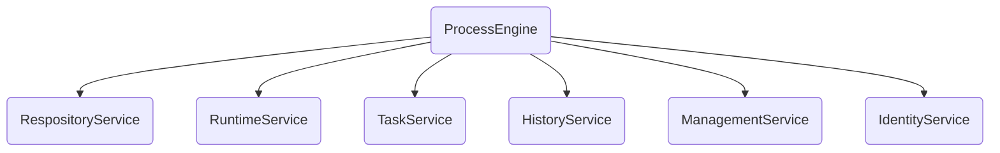

# Camunda 用户指南

本指南面向 Node.JS 开发人员，节选自 [Camunda 官方文档](https://docs.camunda.org/manual/7.13/)，主要设计系统架构、REST API 的使用等。

## 流程引擎 API

### RespositoryService

此服务用于管理**“流程定义”**和**“部署”**。

- **流程定义**：用 BPMN 2.0 描述的流程。

- **部署**：可以含有一个或多个流程定义。

此类服务还包括：

- 查询引擎已知的部署和流程定义
- 挂起并激活流程定义。挂起表示无法对其进行进一步的操作，而激活则是重新允许操作流程定义。
- 检索各种资源。例如：部署中包含的文件或引擎自动生成的流程图。

