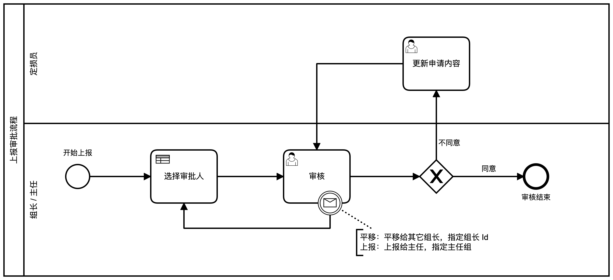

# “上报审批系统”流程设计

[TOC]

## 总体流程图

流程 key：`approval-process`




## 相关角色

- 定损员
- 组长
- 主任
- 包干修复初审
- 高价值件初审
- 总成部件初审
- 调价申请初审


## 开始上报

类型：空白开始事件。

申请人在**申请页面**填报资料，选择上报类型，启动上报审批流程实例。

### 数据

| Name                | 数据类型 | required | 描述                                                         |
| ------------------- | :------: | :------: | ------------------------------------------------------------ |
| state               |  string  | **必填** | 审批状态。<br>取值范围：“初审”、“复审”<br>开始上报时，状态总是：“初审” |
| type                |  string  | **必填** | 审批类型。<br>取值范围：“包干修复”、“高价值件”、“总成部件”、“调价申请” |
| applicant           |  string  | **必填** | 申请人的 User Id。                                           |
| startDate           |   date   | **必填** | 申请提交时间                                                 |
| reportNo            |  string  |   可选   | 报案号                                                       |
| plateNo             |  string  |   可选   | 车牌号                                                       |
| vehicleModel        |  string  |   可选   | 车辆型号                                                     |
| repairPlant         |  string  |   可选   | 修理厂名称                                                   |
| actualCost          |  number  |   可选   | 实际价值                                                     |
| evaluationCost      |  number  |   可选   | 评估底价                                                     |
| purchasePrice       |  string  |   可选   | 新车购置价                                                   |
| agreementAmount     |  string  |   可选   | 一次性协议定损金额                                           |
| investigator        |  string  |   可选   | 定损员姓名                                                   |
| investigateLocation |  string  |   可选   | 定损地点                                                     |
| investigateDate     |   date   |   可选   | 定损时间                                                     |
| identifier          |  string  |   可选   | 识别代码                                                     |
| insurer             |  string  |   可选   | 承保公司                                                     |
| insured             |  string  |   可选   | 被保险人姓名                                                 |
| finalAmount         |  string  |   可选   | 最终价格                                                     |
| deductible          |  string  |   可选   | 自付标准                                                     |
| occurredDate        |   date   |   可选   | 出险时间                                                     |
| quoteDate           |   date   |   可选   | 报价时间                                                     |
| quoteAmount         |  string  |   可选   | 报价金额                                                     |
| targetAmount        |  string  |   可选   | 目标金额                                                     |

> 1. 必填字段会影响流程的执行过程，必须正确填写。
> 2. 可选字段是上报审批数据，用于浏览、搜索，可根据需要填写。


## 选择审批人

类型：业务规则任务。

通过 `assign-approver.dmn` 来选择审批人。

### 条件

| name          | type   | description                                                  |
| ------------- | ------ | ------------------------------------------------------------ |
| state         | string | 审批状态。<br/>取值范围：“初审”、“复审”                      |
| type          | string | 审批类型。<br/>取值范围：“包干修复”、“高价值件”、“总成部件”、“调价申请” |
| approverId    | string | 指定的审批人                                                 |
| approverGroup | string | 指定的审批组                                                 |

### 结果

结果变量名： `approver`

数据结构：

```json
{
  user: "user id",
  group: "group id"
}
```

> Camunda BPM 并不直接支持 JSON 数据格式，实质上在 `approver` 是 java.util.HashMap 类，但是在 Expression 和 Script 中引用该数据时，引用方法和 JSON 数据类似：`approver.user`、`approver.group`。因此，这里用 JSON 数据格式来描述该变量。

### 规则

| 条件           | 选择结果                           |
| -------------- | ---------------------------------- |
| 对于“初审”任务 | 根据“任务类型”，选择对应的初审组。 |
| 对于“复审”任务 | 直接指定审批人、审批组             |


## 审核

类型：用户任务。

审核人在**审核页面**审查申请材料，并决定：批准（`approved`）或不批准（`!approved`）。

### 任务处理人

Assignee：`${approver.user}`

Candidate group：`${approver.group}`

### “重新指定审核人”消息中间事件

审核人可以将审核任务”平移“给其它组长，或”上报“给主任进行处理 —— 通过捕获”移交任务“消息中间事件，中断当前的审核任务，并指定移交的审核人和移交的审核组。

**消息名称**：`reassign-approver`

**消息变量**：

| name          |  type  | description                  |
| ------------- | :----: | ---------------------------- |
| approverUser  | string | 指定的下一个审核人 userId。  |
| approverGroup | string | 指定的下一个审核人 groupId。 |

- 当选择平移时，`approverUser = 指定组长的 userId`，`approverGroup = "组长"`。

- 当选择上报时，`approverUser = ""`，`approverGroup = "主任"`。

> `reassign-approver` 消息由**审核页面**上的“平移”和“上报”按钮抛出。


## 更新申请内容

类型：用户任务

对不批准的申请，申请人需要查看不批准的原因、更新申请内容、重新提交申请（复审）。复审的责任人是最后一个审核申请的人（组长 / 主任）。

### 任务处理人

Assignee：`${applicant}`

> 由申请人更新申请内容。


## 审核结束

类型：空白结束事件

审核被批准后结束，存入历史工作流。