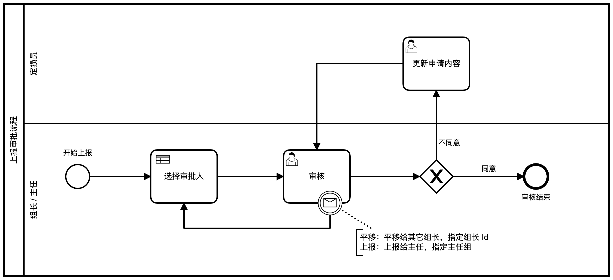

# “上报审批系统”流程详细设计

[TOC]

## 总体流程图




## 角色

- 定损员
- 组长
- 主任
- 包干修复初审
- 高价值件初审
- 总成部件初审
- 调价申请初审


## 开始上报

申请人在**申请页面**填报资料，选择上报类型，启动上报审批流程实例。

### 数据

| Name                | 数据类型 | required | 描述                                                         |
| ------------------- | :------: | :------: | ------------------------------------------------------------ |
| state               |  string  | **必填** | 审批状态。<br>取值范围：“初审”、“平移”、“上报”<br>开始上报时，状态总是：“初审” |
| type                |  string  | **必填** | 审批类型。<br>取值范围：“包干修复”、“高价值件”、“总成部件”、“调价申请” |
| applicant           |  string  | **必填** | 申请人的 User Id。                                           |
| startDate           |   date   | **必填** | 申请提交时间                                                 |
| reportNo            |  string  |   可选   | 报案号                                                       |
| plateNo             |  string  |   可选   | 车牌号                                                       |
| vehicleModel        |  string  |   可选   | 车辆型号                                                     |
| repairPlant         |  string  |   可选   | 修理厂名称                                                   |
| actualCost          |  number  |   可选   | 实际价值                                                     |
| evaluationCost      |  number  |   可选   | 评估底价                                                     |
| purchasePrice       |  string  |   可选   | 新车购置价                                                   |
| agreementAmount     |  string  |   可选   | 一次性协议定损金额                                           |
| investigator        |  string  |   可选   | 定损员姓名                                                   |
| investigateLocation |  string  |   可选   | 定损地点                                                     |
| investigateDate     |   date   |   可选   | 定损时间                                                     |
| identifier          |  string  |   可选   | 识别代码                                                     |
| insurer             |  string  |   可选   | 承保公司                                                     |
| insured             |  string  |   可选   | 被保险人姓名                                                 |
| finalAmount         |  string  |   可选   | 最终价格                                                     |
| deductible          |  string  |   可选   | 自付标准                                                     |
| occurredDate        |   date   |   可选   | 出险时间                                                     |
| quoteDate           |   date   |   可选   | 报价时间                                                     |
| quoteAmount         |  string  |   可选   | 报价金额                                                     |
| targetAmount        |  string  |   可选   | 目标金额                                                     |

> 1. 必填字段会影响流程的执行过程，必须正确填写。
> 2. 可选字段是上报审批数据，用于浏览、搜索，可根据需要填写。


## 选择审批人

通过 `assign-approver.dmn` 来选择审批人。

### 条件


### 结果

选择结果是具有以下结构的变量：

```json
{
  user: "user id",
  role: "role id"
}
```

> Camunda BPM 并不直接支持 JSON 数据格式，实质上在是 java.util.HashMap 类。在 Expression 和 Script 中引用该数据时，引用方法和 JSON 数据类似。因此，我们用 JSON 数据格式来描述该变量。


### 规则

| 条件           | 选择结果                           |
| -------------- | ---------------------------------- |
| 对于“初审”任务 | 根据“任务类型”，选择对应的初审组。 |
| 对于“平移”任务 | 直接指定审批人                     |
| 对于“上报”任务 | 选择“主任”作为审批组               |

